# Git and GitHub 

#devops
- #catalog/devops/git/1-How-Does-Git-Work[How Does Git Work](#how-does-git-work)
- #catalog/devops/git/2-Basics[Basics](#basics)
- #catalog/devops/git/3-Branches[Branches](#branches)
- #catalog/devops/git/4-Git-tools[Git-Tools](#git-tools)
- #catalog/devops/git/5-Remote[Remote](#Remote)
- #catalog/devops/git/6-Github[Github](#Github)
## How-Does-Git-Work
Git is a ==content addressable file system==
- All objects are named by their content and some metadata, by the SHA1.
- This means the Object ID is a hash of its content and some metadata.
 - الobject id بيكون عباره عن hashing للcontent and metadata. خلينا الأول نشوف ازاي بيعمل hashing للfile content بإستخدام SHA1 :
```bash
# Computes the SHA-1 hash of the file
echo "file content" | sha1sum
```
- الoutput هيكون هو الcontent معمول ليها hashing بإستخدام SHA1

- **Object ID** is the SHA-1 hash of the combination of (Type + Size + Empty -byte + Content). Then, the entire object is compressed using zlib and stored in `.git/objects`.
```bash
echo "# Hello" > file.txt
git hash-object  -w file.txt  # d9d70c24232d59c4d4544b67b3e3d5d01d818a22

# How does git generate a sha: 
ls -l file.txt # get the file size: 15B
echo -e "blob 15\0# Hello" | sha1sum # blob: object type , \0: empty-byte, # Hello: file content
```
- gives the same SHA-1 hash as `git hash-object file.txt`

**Read Git Object Content(Decompress Object ID):**
```bash
pigz -dc .git/objects/<sha-prefix | sha id>/<sha-suffix> 
pigz -dc .git/objects/d9/d70c24232d59c4d4544b67b3e3d5d01d818a22 # Output: blob 15# Hello
git cat-file -t <sha> # object type
git cat-file -s <sha> # size
git cat-file -p <sha> # data
```

#Demo/devops/git/ObjectStructure
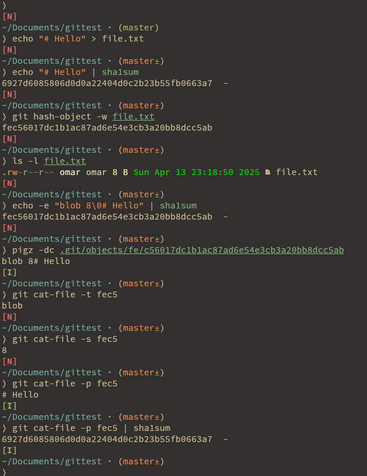

---
### Blob
- It represents a snapshot of the file content at a certain commit.
- Each blob is identified by a SHA-1/SHA-256 hash of its contents.
```bash
# Let’s say you have a file hello.txt that contains:
Hello, Git!
# Git creates a blob object with the content Hello, Git!. You can inspect it using:
git hash-object hello.txt
# That returns the SHA hash of the blob. To see the contents of the blob:
git cat-file -p <SHA>
```
**Relationship with Other Git Objects:**
- Blob – raw file content
- Tree – directory structure, connects blobs and filenames. pointers to blobs (which represent file contents)
	- Tree stores important data about: 
		1. file mode (permissions): 
			- file permissions in git are: 
				1. normal file = 100644
				2. executable = 100755
				3. shortcut / symbolic = 120000
				4. folder = 40000
		2. file name 
		3. file data(blob)
		- tree: `<type = tree> <file size> <empty-byte> + <permission> <file name> <empty-byte> <blob-id>`
	```bash
	⟩ git ls-tree HEAD                                                                                                                                                    main
	100644 blob e033bc68e0ae2c9cca48c5a9ddb3584af5baa8e7	.gitignore
	100644 blob d9b2209b4c5c7cde7a7fdbf286aaed8d4a23c853	README.md
	040000 tree b31a2b75f71201a2590a5e36e4f0f5b6e09fccf6	scripts
	100644 blob 5a206e4cde86b252025f47b890f672d3f6081c98	Xresources
	040000 tree 53a19861cc4d78cd99b418a1907e98a0c4e8a4cf	acpi
	100644 blob 60eaf98692073dca36bac3a99fa5c0c3ae1d0b51	bash_profile
	100755 blob fe3133bd66ae4aa2141ef2d37dda736cc7473dee	bashrc
	100644 blob d1e63ffccde2067a8ee2282f488eb579f771d80e	color_hex.txt
	100644 blob 9ebc477b6d678f7663abb6b0b4129249dae78787	config.def.h
	040000 tree 44ab4d4c7969ce92e984efb0a8a6bfe3e9afbe67	config
	100644 blob b19bd5e04e96f3aeb3f13ac28aa7b586ea1a0316	gruvbox.png
	
	⟩ git ls-tree b31a2b75f71201a2590a5e36e4f0f5b6e09fccf6                                                                                                                main
	100755 blob cbbe4e1b072feac2102df0c9f7bee559e578995b	backup.sh
	100755 blob 5e6abd9acec5e9dd66ba5db2009f9fd60b587ed1	battery.sh
	100755 blob 781a21c3a9417bcea3c4bc372c1c84fb1b2f2dc7	browser.sh
	```
- Commit – points to a tree and includes metadata (author, message, etc.)
---
## Basics
### Ignoring
- `.gitignore` is used to track what we ignore (as a team)
- `.git/info/exclude` is used when the ignored files are auxiliary files that live inside the repository but are specific to one user’s workflow
```bash
# Add a file to Staging
git add . 
# files added to the index can't be ignored so we need add ignored files to gitignore file before run `git add`
# Add a file to Staging with dry run to see what be staged without actually staging anything
git add . --dry-run | git add . -n
```
**Local Exclusions**
- This works just like .gitignore, but it’s local to your machine.
- File path: `.git/info/exclude`
- Use when you want to ignore something on your system (e.g., temp files, editor files, build outputs)
```bash
vi .git/info/exclude # add files here
```
#### How to ignore a file after added to the staging
1. Remove from the Staging
```bash
git rm --cached <file>
```
2. Add to gitignore
```bash
vi .gitignore # then add the file here
git status
```
**Commit**
```bash
git commit -m "message"
git log | git log --oneline
```
---
### Staging lines not files
```sh
# edit the patch for a specific file before staging it:
git add <file> -e
```
- will open: 
```sh
diff --git a/file.txt b/file.txt
index 0154576..b2dc769 100644
--- a/file.txt
+++ b/file.txt
@@ -1,3 +1,3 @@
-s to split a hunk into smaller pieces
+A the first line

-e to manually edit a smaller hunk instead
+B the second line
```
- Need to commit first line only so we need to remove +B line and remove - from the beginning of line like below:
```sh
diff --git a/file.txt b/file.txt
index 0154576..b2dc769 100644
--- a/file.txt
+++ b/file.txt
@@ -1,3 +1,3 @@
-s to split a hunk into smaller pieces
+A the first line

e to manually edit a smaller hunk instead
```
- use `git diff` to show what you’ve changed but haven’t staged yet:
```sh
⟩ git diff                                                                                                                                                      master ✚ ✱
diff --git a/file.txt b/file.txt
index 1d40820..b2dc769 100644
--- a/file.txt
+++ b/file.txt
@@ -1,3 +1,3 @@
A the first line

-e to manually edit a smaller hunk instead
+B the second line
```
- use `git diff` to show what have I added to the staging area, but not committed yet:
```sh
⟩ git diff --staged                                                                                                                                             master ✚ ✱
diff --git a/file.txt b/file.txt
new file mode 100644
index 0000000..1d40820
--- /dev/null
+++ b/file.txt
@@ -0,0 +1,3 @@
+A the first line
```
- commit changes:
```sh
git commit -m "added A line"
git add . 
git commit -m "added B line"
```
- show the changes using specific hash: 
```sh
⟩ git show f09cbfc
diff --git a/file.txt b/file.txt
index 8006cd2..beec36b 100644
--- a/file.txt
+++ b/file.txt
@@ -1,3 +1,5 @@
A the first line
+
B the second line
+
c the third line
```
---
### Unstaging
- From the staging to working directory(Unstaging a file):
```sh
git restore --staged <file>
```
- From the staging to the last commit: 
```sh
git restore --staged <file>
# Undo my local changes to this file:
git restore --worktree <file> 
```
- Can do this using one command: 
```sh
git restore --worktree --staged <file>
```
- show files in the staging: 
```sh
git ls-files
```
#### rm --cached vs restore --staged
- rm --cached = "Forget this file ever existed"
- restore --staged = "Just undo git add, I’m still working on it"
```sh
# restore --staged:
⟩ git add .
⟩ git restore --staged test.txt
⟩ git ls-files # the previous command doesn't remove the file from the staging
file.txt
test.txt
# rm --cached:
⟩ v test.txt
⟩ git add .
⟩ git rm --cached test.txt
rm 'test.txt'
⟩ git ls-files
file.txt
```
#Demo/devops/git/staging
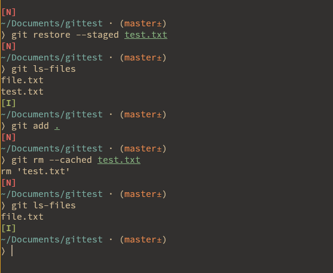

- **restore --staged:**
	- Unstage the file (removes it from the staging area only)
	- Keeps the file in your working directory AND keeps it tracked by Git
	- Preserves any changes to the file
	- Use this when you accidentally staged changes you don't want to commit yet
- **rm --cached:**
	- Removes the file from the staging area AND from Git tracking
	- The file remains in your working directory as an untracked file
	- Use this when you want to stop tracking a file that you've previously committed
	- Use Case: 
		1. Use when you want to stop tracking a file and/or delete it from the repository.
		2. Accidentally committed a sensitive or environment-specific file (like .env, config.json)
	- Example:
		1. You committed `config.json`:
			```sh
			    git add config.json
			    git commit -m "Add config"
			```
		2. Then realize..."Oops, that shouldn't be in version control!"
		3. Fix: 
			```sh
			    echo "config.json" >> .gitignore
			    git rm --cached config.json
			    git ls-files # the previous command will remove the file from the staging
			    git commit -m "Remove config.json from tracking"
			```

#### For More: [[./materials/Restore --staged vs Rm --cached]] #Demo/devops/git/RestoreandRm

---
### Rollback Strategies
**there're three main ways to undo a commit:**
1. Revert
2. Reset
3. Amend
	
- **Revert:**
	- If you want to undo a specific commit (without rewriting history), use:
		```sh
			git revert <commit-hash>
		```
	- This creates a new commit that undoes the changes from the specified commit.
- **Reset:** 
	- It basically lets you move your branch pointer and optionally mess with the staging area and/or working directory.
	- can use three options:
		```sh
				git reset --< soft || mixed || hard > HEAD~<the last N commits>
				or
				git reset --<soft || mixed || hard > HEAD@{the last N commits}
		```
		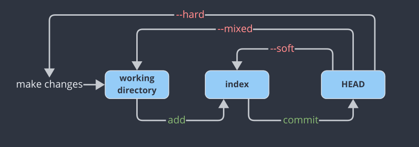
		1. `--soft`
			- Moves HEAD to the given commit.
			- Keeps all changes staged.
			- #Demo/devops/git/softreset
			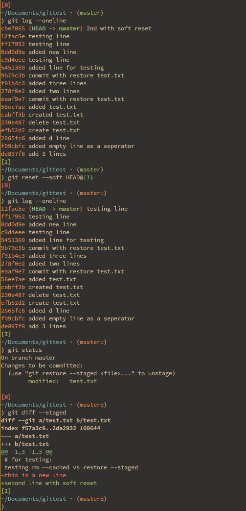
			
		2. `--mixed`(default)
			- Keep the changes in your working directory.
			- Unstage those changes (so git status will show them as modified, but not staged).
			- #Demo/devops/git/mixedreset
			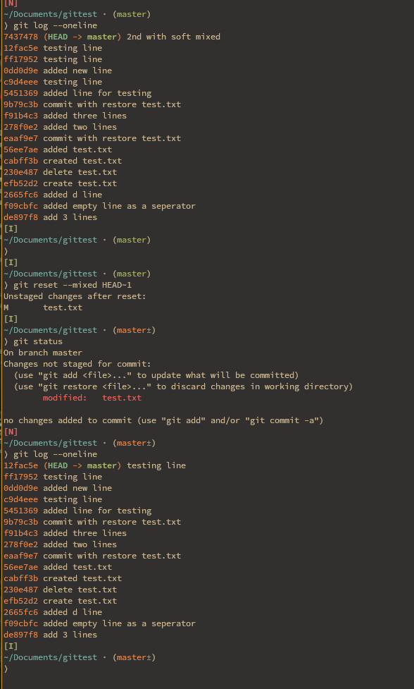
			
			
		3. `--hard`
			- Discard all file changes made in those commits — permanently.
			- Reset your working directory and staging area to match the state of the commit you're resetting to.
			- #Demo/devops/git/hardreset
			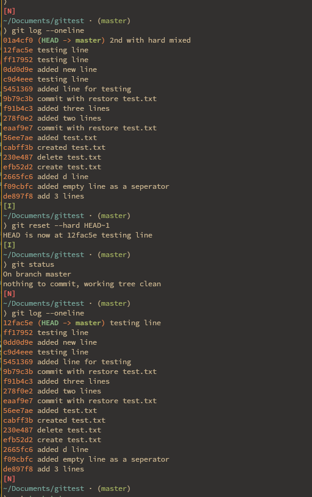
	
- **Amend:** 
	- Amend is the option to edit the last commit.
	- Fixing mistakes right after committing.
		```sh
			# fixing something after committing 
			git commit --amend --no-edit
			# Change the commit message only 
			git commit --amend -m "New commit message"
		```
	- **Amend with no edit option:** #Demo/devops/git/Amendnoedit 
		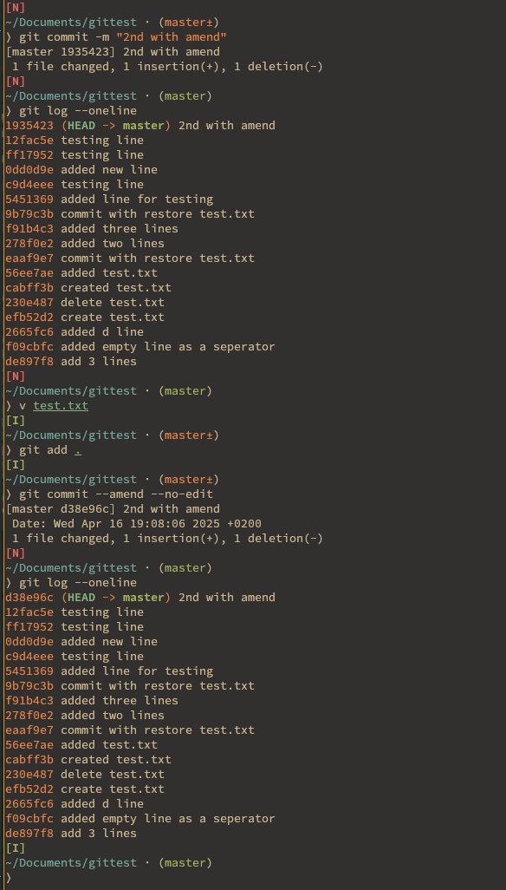
	- **Amend with New commit:** #Demo/devops/git/Amendnewcommit
		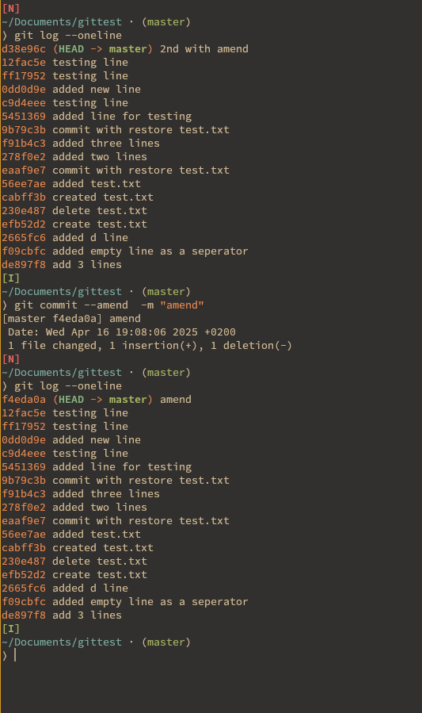
---
**Reflog**
- Think of it as a record of where your HEAD and branch references have been
- it is an alias for `git log -g --abbrev-commit --pretty=oneline`
```sh
⟩ git reflog
f4eda0a (HEAD -> master) HEAD@{0}: commit (amend): amend
d38e96c HEAD@{1}: commit (amend): 2nd with amend
1935423 HEAD@{2}: commit: 2nd with amend
12fac5e HEAD@{3}: reset: moving to HEAD~1
01a4cf0 HEAD@{4}: commit: 2nd with hard mixed
12fac5e HEAD@{5}: reset: moving to HEAD~1
7437478 HEAD@{6}: commit: 2nd with soft mixed
12fac5e HEAD@{7}: reset: moving to HEAD~2
48c1f1b HEAD@{8}: commit: 2nd with soft mixed
7536602 HEAD@{9}: commit: 2nd with soft mixed
...
```
---
### Stashing | Storing Changes for Later
- stashing is putting working directory changes outside the commit history because they aren't yet ready to be committed.
```sh
~/Documents/gittest
⟩ git status
On branch master
Changes not staged for commit:
  (use "git add <file>..." to update what will be committed)
  (use "git restore <file>..." to discard changes in working directory)
	modified:   test.txt

no changes added to commit (use "git add" and/or "git commit -a")
```

```sh
~/Documents/gittest
⟩ git stash
Saved working directory and index state WIP on master: f4eda0a amend
```

```sh
~/Documents/gittest
⟩ git status
On branch master
nothing to commit, working tree clean
~/Documents/gittest
⟩ v file.txt
~/Documents/gittest
⟩ git status
On branch master
Changes not staged for commit:
  (use "git add <file>..." to update what will be committed)
  (use "git restore <file>..." to discard changes in working directory)
	modified:   file.txt

no changes added to commit (use "git add" and/or "git commit -a")
```

```sh
~/Documents/gittest
⟩ git add .
~/Documents/gittest
⟩ git commit -m "remove c and d lines from file.txt"
[master eae86e5] remove c and d lines from file.txt
 1 file changed, 4 deletions(-)
~/Documents/gittest
⟩ git status
On branch master
nothing to commit, working tree clean
```

```sh
⟩ git stash list
stash@{0}: WIP on master: f4eda0a amend
~/Documents/gittest
⟩ git stash apply
On branch master
Changes not staged for commit:
  (use "git add <file>..." to update what will be committed)
  (use "git restore <file>..." to discard changes in working directory)
	modified:   test.txt

no changes added to commit (use "git add" and/or "git commit -a")
~/Documents/gittest
⟩ git status
On branch master
Changes not staged for commit:
  (use "git add <file>..." to update what will be committed)
  (use "git restore <file>..." to discard changes in working directory)
	modified:   test.txt

no changes added to commit (use "git add" and/or "git commit -a")
```
- **play with stash:**
```sh  
# reapply changes, but keeps them in the stash list
git stash apply
# shows all stashes
git stash list     
stash@{0}: WIP on main: abc123 Added feature X
stash@{1}: WIP on dev: def456 Quick fix
# reapply and remove that stash from the stash list.
git stash pop 
git stash pop stash@{1}
# drop the stash
git stash list
git stash drop stash@{1} # By default, it drops stash@{0}
# deletes all stashes without confirmation
git stash clear
# stash with message
git stash -m "message"
# By default, git stash ignores untracked files
git stash -u # include untracked files
```
---
### Revisiting Commits
```sh
git checkout <commit-id> # move HEAD to a certain commit
```
- **Note:** this command detach HEAD from main, ==Normally, Head point to the branch(main): HEAD -> main -> latest commit==
- Detached HEAD: If you checkout a specific commit (instead of a branch), ==HEAD no longer points to a branch, just to a commit==
	```sh
		git checkout <commit-hash>
		# Now it becomes:
		HEAD -> <commit> (no branch)
	```
- This is called a `detached HEAD` state.
- Any commits you make here will not be attached to a branch.
- If you switch branches without saving them (like creating a new branch), those commits will be lost.
	```sh
		git branch <branch name> <commit>
	```
	
#Demo/devops/git/checkout		
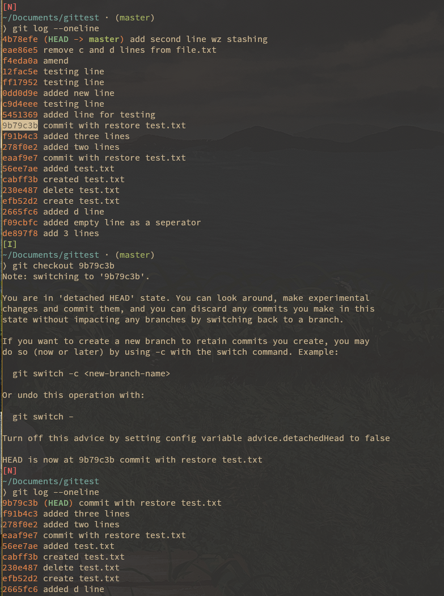 
```sh
# undo this 
git checkout master
```

#Demo/devops/git/checkoutWithNewBranch
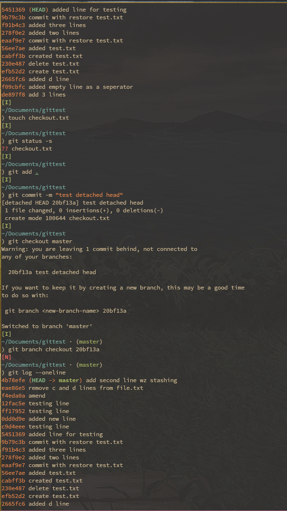

```sh
git log --oneline --graph --decorate --all
# alias this command to git lol
git config --global alias.ll "log --oneline --graph --decorate --all"
# Remove an alias
git config --global --unset alias.<alias>
git config --global --unset alias.ll
```
#### Reset vs Checkout
- Reset: Moves the branch pointer backward (or forward) to a different commit, Moves HEAD, Moves Branch:  modifies where your branch points
- Checkout: Moves your HEAD (current working pointer) to another commit, Moves HEAD, Not Moves Branch unless switching branches
### Tags
- Mark commits without branching. Using a tag instead of a branch.
- You checked out a past commit: 
	```sh
		git checkout eaaf9e7 # HEAD -> eaaf9e7 (detached)
		# Create tag
		git tag <tag name> <commit id>
		# Now can use:
		git checkout <tag name>
	```
---
## Branches
```sh
# create a branch
git branch <branch name>
# switch to a branch
git checkout <branch name> | git switch <branch name>
# create a branch and switch to it 
git checkout -b <branch name> | git switch -c <branch name>
# rename a branch's name
git branch -m <branch> <new name>
```
### Merge
- What it does: Combines the histories of two branches together by creating a new merge commit
- Keeps history as-is: You can see the actual history of how development happened
- There are two types of merge strategies: 
	1. **Fast-Forward Merge**
		- Git just moves the branch pointer forward, **no new commit is created**
		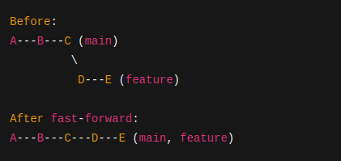
		```sh
			git merge <feature branch> <main branch>
		``` 
		
		```sh
			git checkout -b add
			echo "Hi from the add branch" >> add.txt
			git add . 
			git commit -m "Hi txt file to the add branch"
			git switch master 
			git merge add master 
			ls -l # will find the add.txt file
		```
		#### Before the merge
		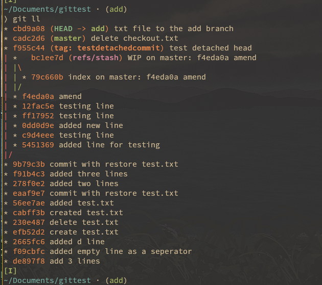
		#### After the merge - No new commit is created
		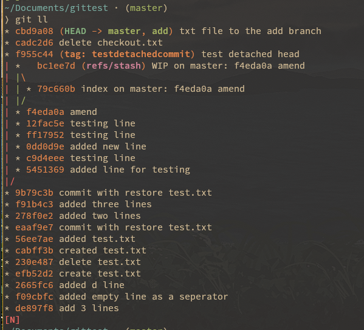
		#### Merge Conflict
		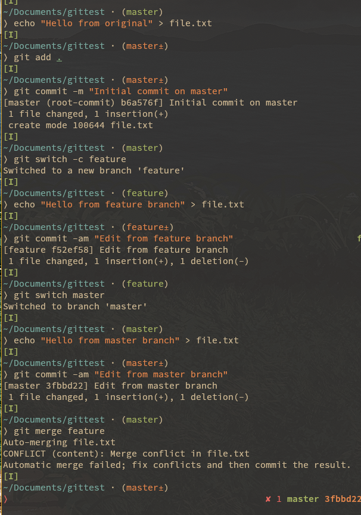
		#### The Conflict: 
		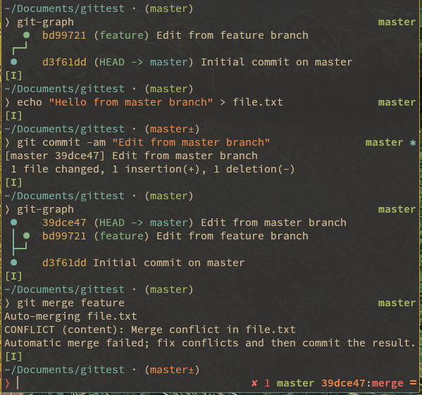
		 1. **==Base Commit (Common Ancestor): d3f61dd==**
		 2. **==Your Branch (master): 39dce47==**
		 3. **==Other Branch (feature): bd99721==**
		 - How to Fix the Conflict:  `Using 3-Way Merge`
	 2. 3-Way Merge
		- Git uses the common ancestor of the two branches and the tips of both branches to create a new merge commit.
		- Solve the Conflict:
			 - Open file.txt: 
				 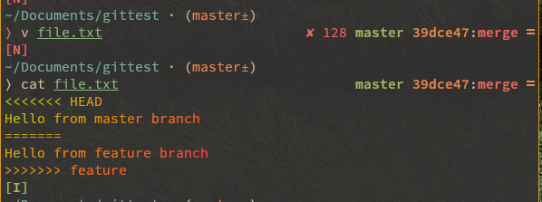
				 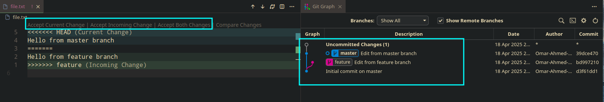
			- Decide how to resolve as shown above: 
				1. Keep master’s version: the file will be: `Hello from master branch`
				2. Keep feature’s version: the file will be: `Hello from feature branch`
				3. Or combine them: the file will be: 
					```txt
						Hello from master branch
						Hello from feature branch
				   ```
			- Save and mark it resolved: 
				```sh
					git add file.txt	
					git commit -m "msg"
			   ```
			   
				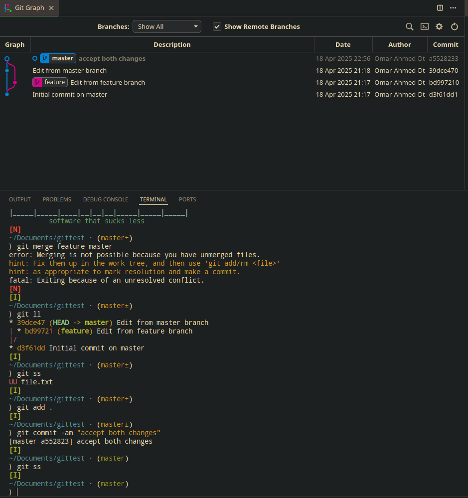
				   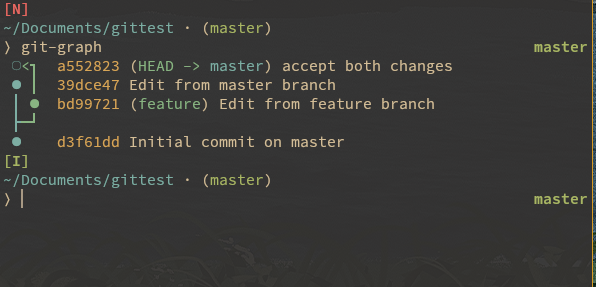
				   **in a 3-way merge, when you resolve the conflict and finish the merge, Git creates a new commit that has two parents: (main branch commit) and (merged branch commit)**
				   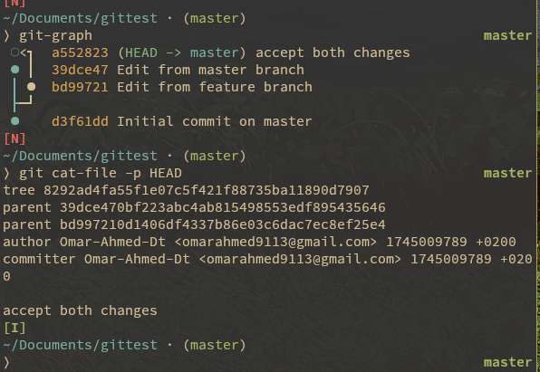
### Rebasing
- Rebase moves (or "replays") commits from one branch on top of another, as if the changes were made from there originally.

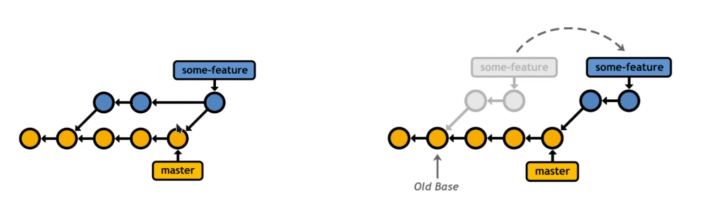

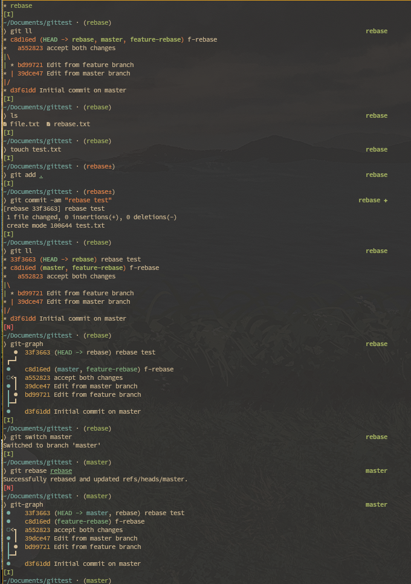

---
## Git-Tools
### Interactive Rebasing
- exists to give you full control over your commit history.
- **Why not just use git commit --amend?**
	- Because --amend only fixes the last commit.
	- rebase -i lets you edit or rewrite ANY commit in the past.
```sh
	git rebase -i <HEAD~n> # n is a number of commits you want to look at
	git rebase -i HEAD~6
```
#### Interactive Rebasing Options
1. `pick`: Use the commit as-is: 
	- Keep the commit exactly the same.
	- No changes. Just keeps it
2. `reword`: Change the commit message:
	- Keep the commit's code, but edit its message.
	- This opens the editor to change the message.
3. `edit`: Change the commit code/content:
	- Pause at that commit to change the code.
	- Git will stop and let you:
		```sh
			# make your changes
			git add .
			git commit --amend
			git rebase --continue
		```
4. `squash`: Combine this commit with the previous one:			
	- Merge two commits together and edit the combined message.
	- This will merge the second into the first, and ask you to write one commit message for both.
5. `fixup`: Like squash, but skip the second commit's message:
	- Combine two commits but keep only the first message.
	- Cleans history without even asking for a message.
6. `drop`: Delete the commit:
	- Remove it from history.
	- That commit is gone — like it never happened.
	
**Note:**
```sh
# It allows you to modify commit's rebase options after the rebase has already started(that means you were manually editing the todo list)
git rebase --edit-todo
# Start rebasing from the very first commit (root) and include everything
git rebase -i --root
```
#### For More: [[Git_Interactive_Rebase_Demo]] #Demo/devops/git/InteractiveRebase 
### Cherry-Pick
- is used to apply a specific commit from one branch onto your current branch — without merging the whole branch.
	```sh
		git checkout main
		git cherry-pick <commit id>
	```
- Now the changes from that commit are applied on main as a new commit.
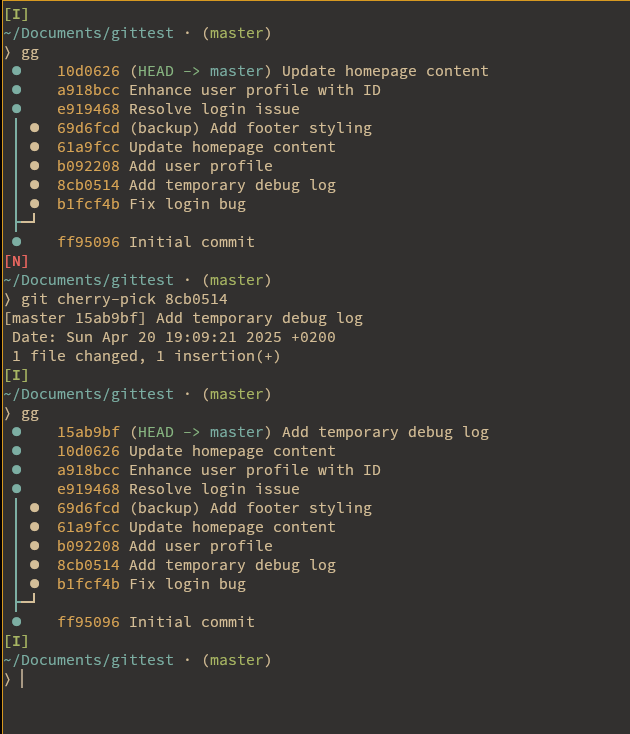
```sh
# to edit the commit
git cherry-pick -edit <commit id>
```
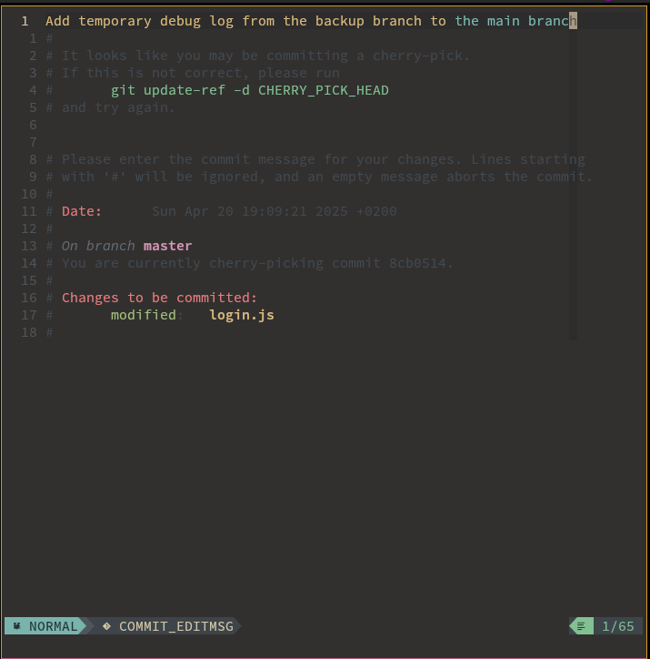
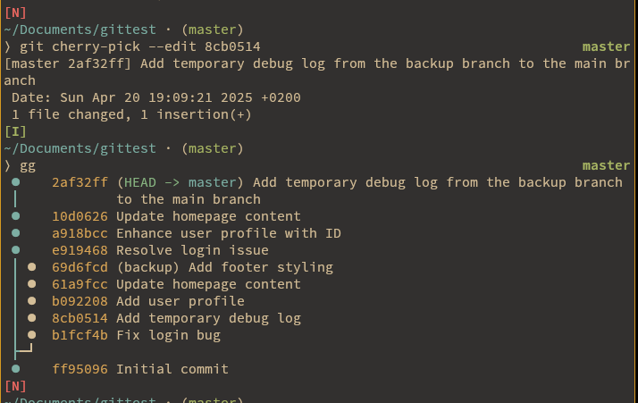
```sh
# applies the changes from a specific commit to your current branch, without creating a commit
git cherry-pick --no-commit <commit id>
```
- Why use `--no-commit`?
	- modify the changes before committing, combine multiple cherry-picked commits into one, and review and stage only some parts of the changes
	- The changes from commit id are applied to your working directory
	- No new commit is created, You can now Edit the files then Stage only specific files or lines then Commit with your own message
	
- can cherry-pick multiple commits in one command:
```sh
git cherry-pick <start-commit>..<end-commit> --no-commit
git cherry-pick b0922..69d6
```
---
### Bisect
- Use **binary search** to find the commit that introduced a bug
- This command uses a binary search algorithm to find which commit in your project’s history introduced a bug
```sh
# start the bisect process
git bisect start
git bisect bad <commit id>
git bisect bad # the bad commit is the current commit
git bisect good <commit id>
# stop the bisect process
git bisect reset
```
- mark when bug was last found (bad)
- mark when bug wasn't there (good)
- points to middle:
	- if the middle is buggy (bad): move bad pointer (left)
	- if the middle is safe (good): move good pointer (right)
```sh
git bisect start
git bisect bad
git bisect good <commit id>
git bisect run './script'
```

#demo/devops/git/bisect
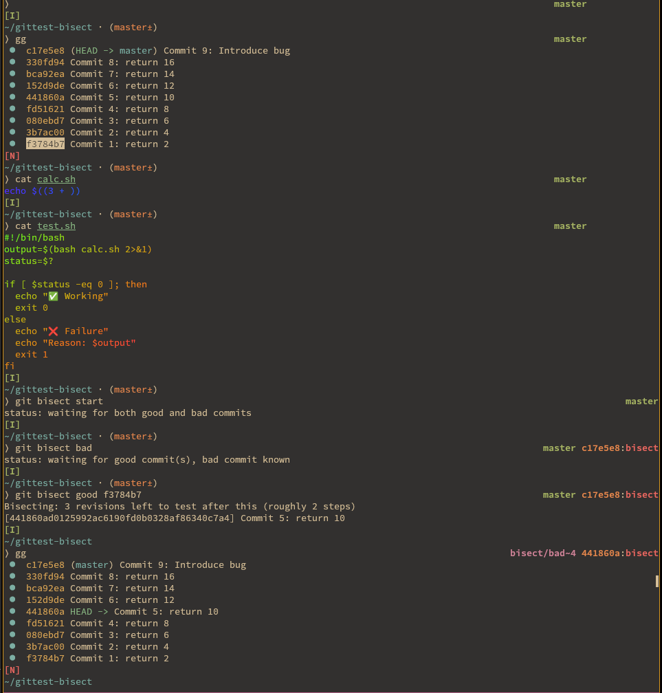
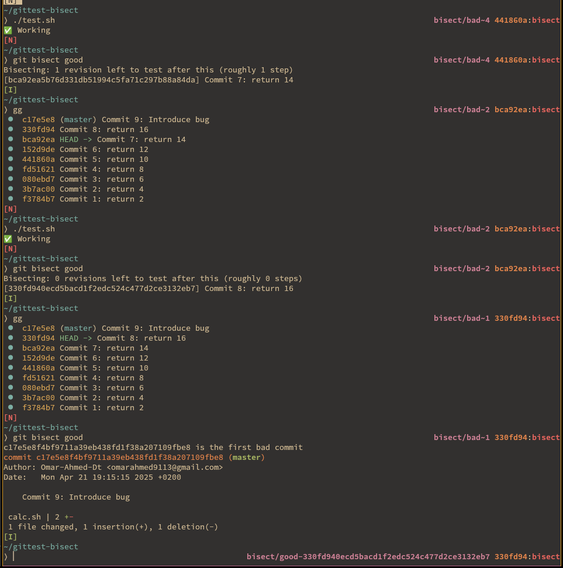
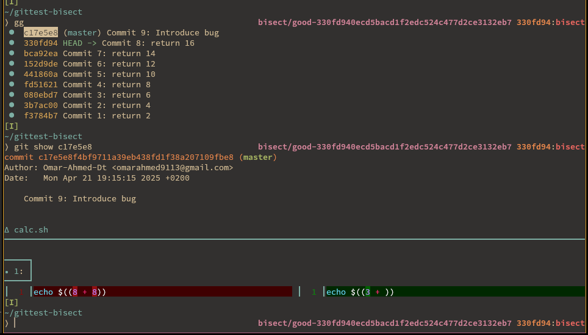
**or using bisect run command:**
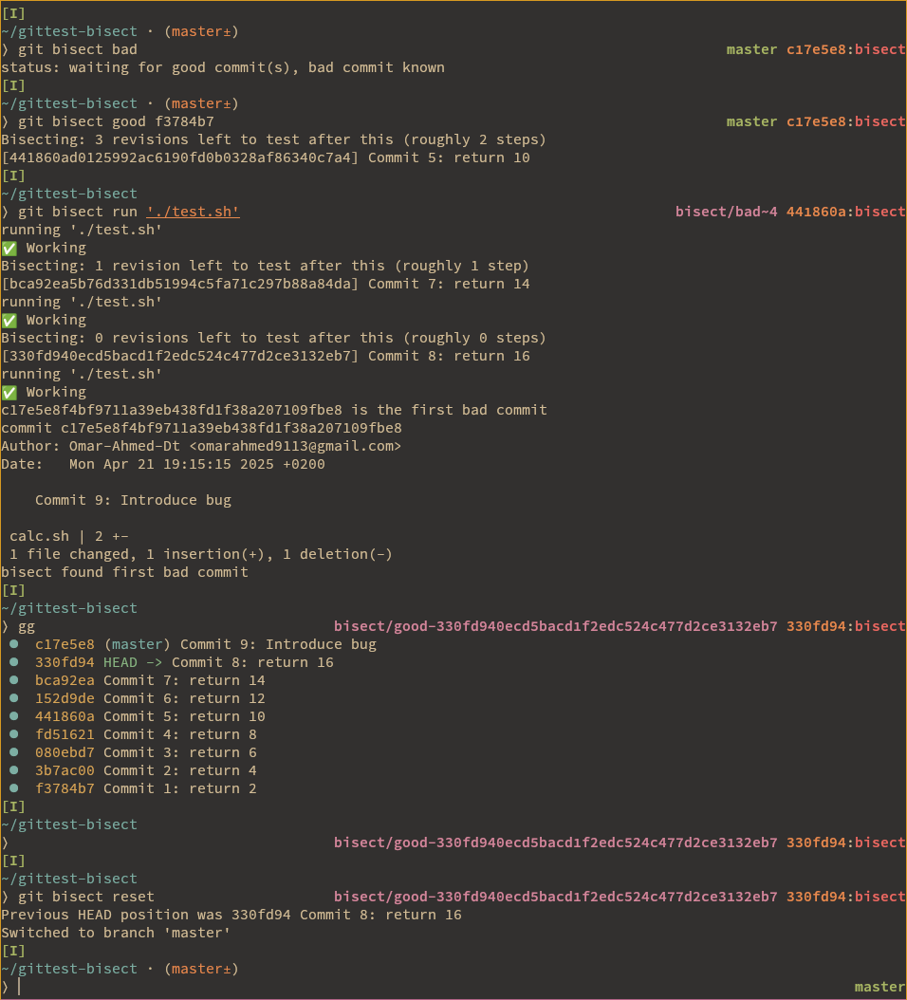
### Blame
- Show what commit and author last modified each line of a file
- It shows line-by-line commit history for a file.
```sh
git blame <file>
```
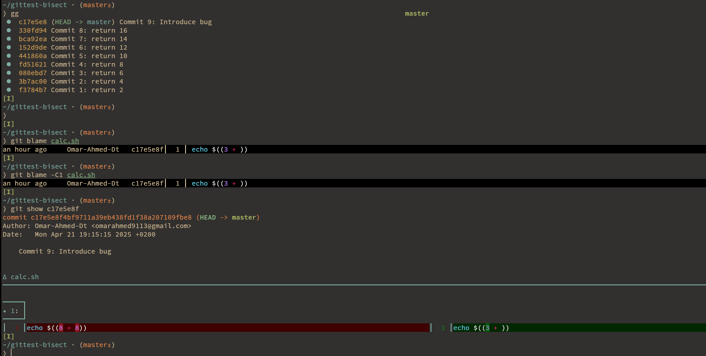

---
## Remote
### Remote Repository
- a remote repository is a version of your project that's hosted on the internet or another network. It's typically used to collaborate with others
- A remote repository is generally **a bare repository** — a Git repository that has no working directory.
- In the simplest terms, a bare repository is the contents of your project’s `.git` directory and nothing else. 
- A bare repository in Git is a repository that only contains the version history (the `.git` folder contents) and no working files (no actual project files like code, images, etc.).
- In a bare repo:
	- There’s no working directory (no editable files).
	- It's mainly used as a central shared repository that developers can push to and pull from.
```sh
git init --bare our-project
```

```sh
$ cd our-project
$ ls -l
	config 
	description
	HEAD
	hooks
	info
	objects
	refs
```

```sh
# Add a remote repo:
# git remote add <remote repo name> <link for remote repo> | <path to remote repo>
git remote add origin https://github.com/username/repo.git
# or 
git remote add origin ../server/our-project 
```

```sh
# check after created a remote repo
$ git remote
	origin
$ git remote -v 
	origin	../../test/myproject.git/ (fetch)
	origin	../../test/myproject.git/ (push)

# push to a remote repo
$ git push <remote repo name> <branch>  
$ git push origin main

# clone a remote repo
git clone <path | link>

# fetch from a remote repo
git fetch <remote name>

# merge using fast forward
git merge origin/main

# pull (fetch and merge)
git pull
```
### Upstream 
- upstream usually refers to the remote branch that your local branch tracks.
- your need to set the upstream manually: 
	- First time you push a new local branch.
	- When you create a new branch locally, Git doesn’t know where it should push it yet.
```sh
# Manually set an upstream
git branch --set-upstream-to=origin/main # will create a new branch (main branch) on remote repo
# or
git branch -u origin main
# undo that
git branch --unset-upstream
```
### Reconciling Branches
- reconciling a branch in Git usually means bringing it up to date with another branch, merging changes, or resolving conflicts between them.
- When do you need to reconcile branches?
	- If someone else pushed updates you don't have yet.
	- If you're trying to merge, rebase, or pull and there are conflicts.
	- If your branch is behind main. 
```sh
# if the local repo is behind the remote, there are four ways to solve this conflict:

## 1.First Option: will fail in this conflicted case 
git pull --ff-only  # the default option

## 2.Second Option
git pull --rebase # rebase: Accept Current Change | Accept Incoming Change | Accept Both Change
git add .
git rebase --continue

## 3.Third Option: will try the three way merge
git pull --no-rebase # Accept Current Change | Accept Incoming Change | Accept Both Change
git add .
git merge --continue

## 4.Fourth Option: force Git to update the remote branch to match your local branch even if it would normally be rejected
git push -f
```

#demo/devops/git/reconcilingBranches
**Try With Fast-Forward**
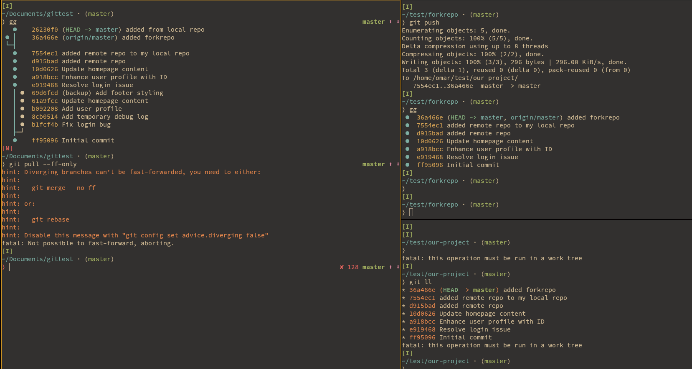
**Try With Rebase**
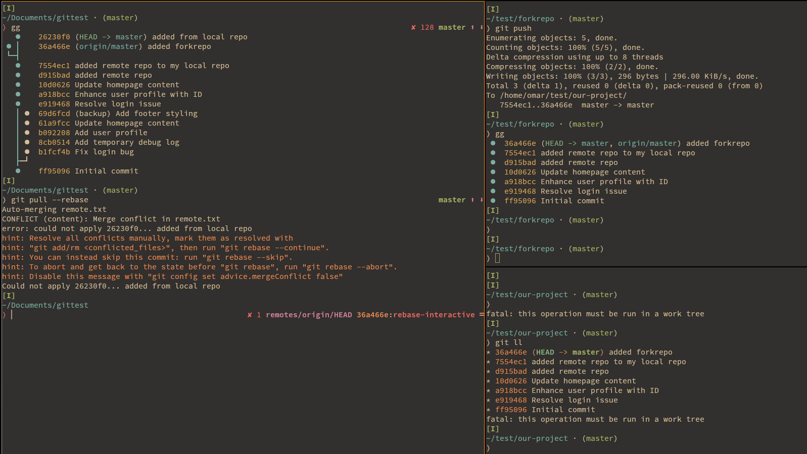
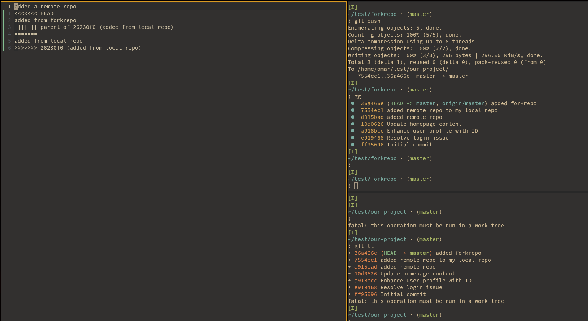
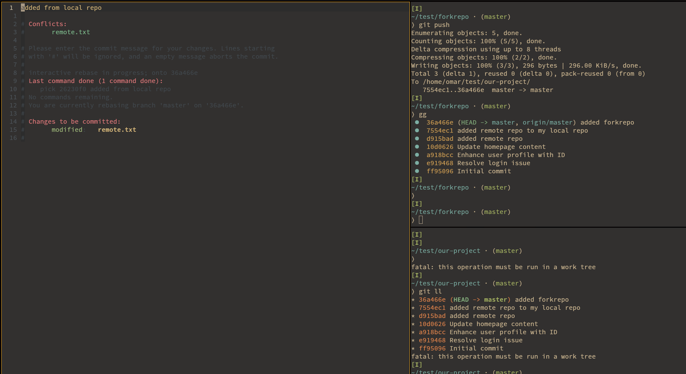
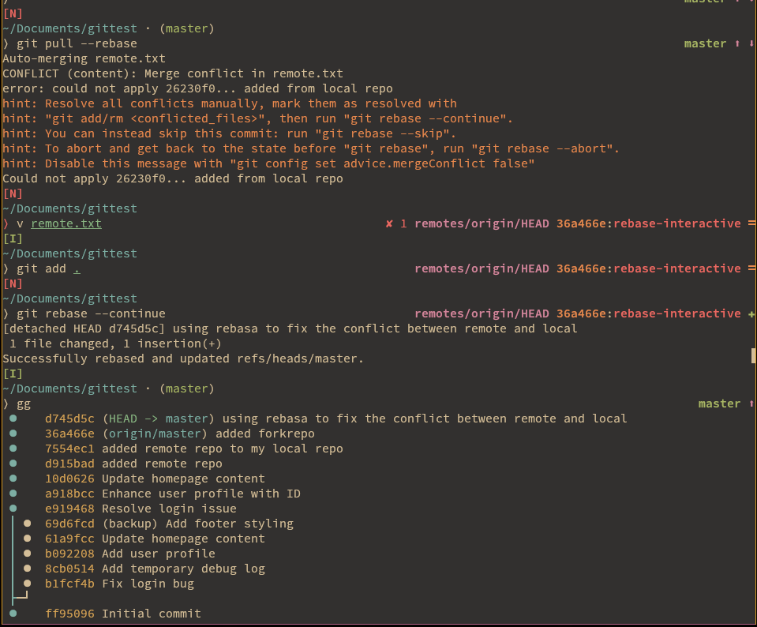
**Try With Three Way Merge**
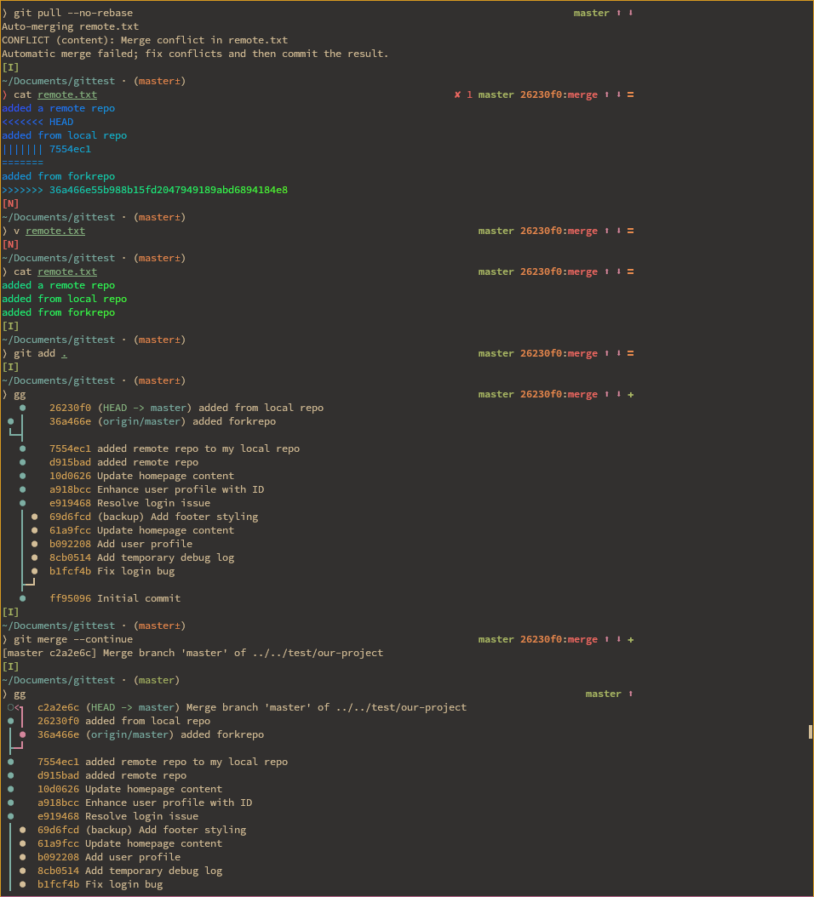
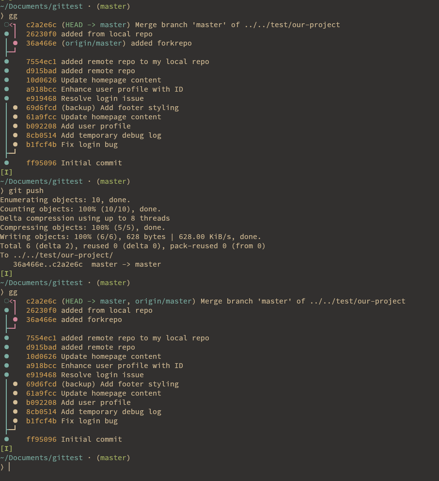

---
## GitHub
- GitHub is hosting service for Git repositories.
- Other hosting services: Gitlab and Bitbucket
### Tokens
- The first time you interact with a remote repository, Git will ask for your username and password(Token).
- After you provide them, Git will save these credentials into that file`~/.git-credentials`.
- Git will automatically use these saved credentials for that repository without asking again using the command below.
```sh
git config --global credential.helper store
```
### Adding Collaborators
- You can invite users to become collaborators to your personal repository.
- [Add Collaborators](https://docs.github.com/en/account-and-profile/setting-up-and-managing-your-personal-account-on-github/managing-access-to-your-personal-repositories/inviting-collaborators-to-a-personal-repository)
```txt
From Repo > Settings > Collaborators > Add People
```
- **Collaborator vs Contributor:**
	- Collaborator: 
		- Someone you invite directly to your repository. 
		- Access: They can push code, manage branches, review PRs, handle issues — basically almost full write access.
		- Permission: You must manually add them via repository settings.
	- Contributor: 
		- Anyone who sends a pull request that gets merged into your project.
		- Access: They don't have special permissions.
		- Permission: No invitation needed — anyone can contribute by forking, coding, and making PRs.
### Issues and milestones
- [issue](https://docs.github.com/en/issues/tracking-your-work-with-issues/using-issues/creating-an-issue)
- milestone:
	- A collection of issues/PRs linked to a specific target (like v1.0 release, "Beta Launch", etc.).
	- You can set a due date, track progress, and see how much work is done.
	- [milestones](https://docs.github.com/en/issues/using-labels-and-milestones-to-track-work/creating-and-editing-milestones-for-issues-and-pull-requests)
### Creating a Pull Request
```sh
git swtich -c multiply 
git add . 
git commit -m "message"
git push -u origin <remote branch>
git push -u origin multiply 
# GitHub will show a "Compare & pull request" button — click it.
# Write a title and description for your pull request.
# Click "Create pull request".
```
### GitHub flow to collaborate on projects 
- [The 6 basic steps of GitHub Flow](https://docs.github.com/en/get-started/using-github/github-flow)
### Fork
- You can create a pull request to propose changes you've made to a fork of an upstream repository.
- [Creating a pull request from a fork](https://docs.github.com/en/pull-requests/collaborating-with-pull-requests/proposing-changes-to-your-work-with-pull-requests/creating-a-pull-request-from-a-fork)
### Release
- Releases are deployable software iterations you can package and make available for a wider audience to download and use.
- [Managing releases in a repository](https://docs.github.com/en/repositories/releasing-projects-on-github/managing-releases-in-a-repository)
---