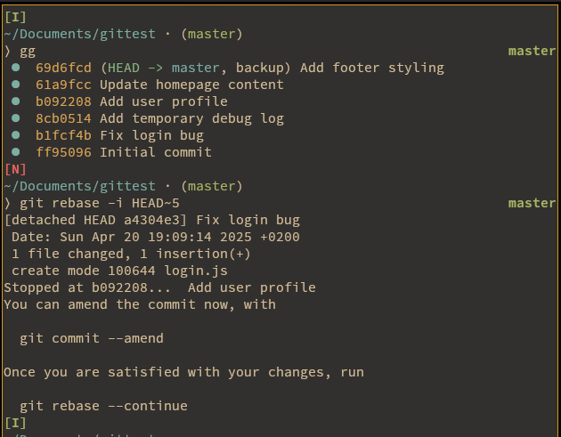
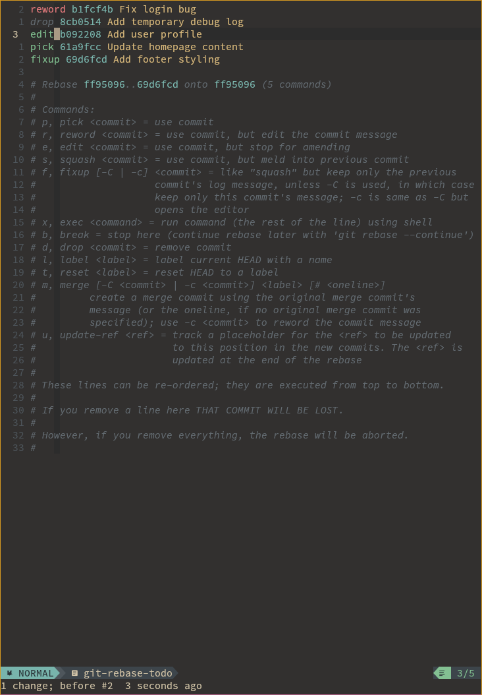
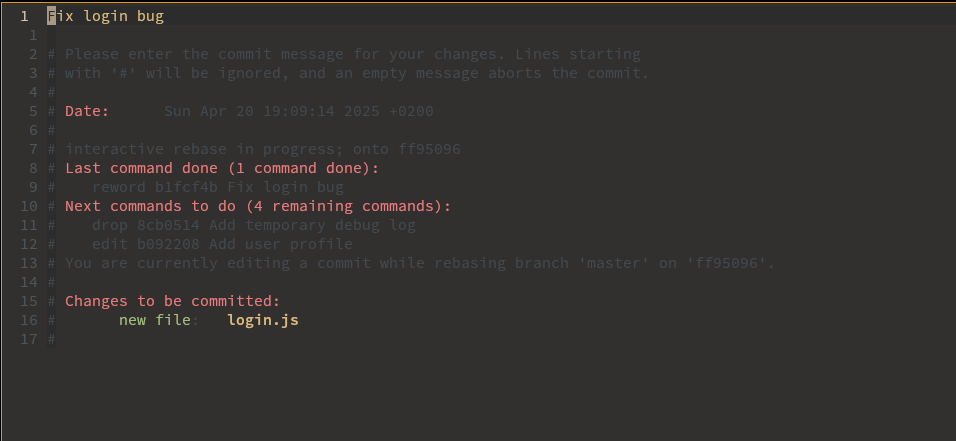
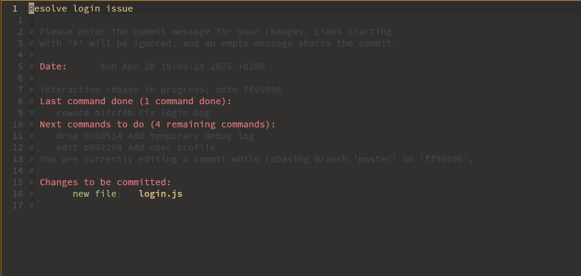
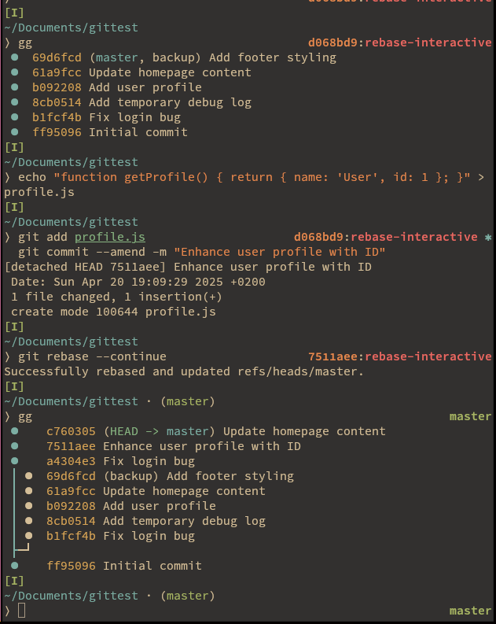
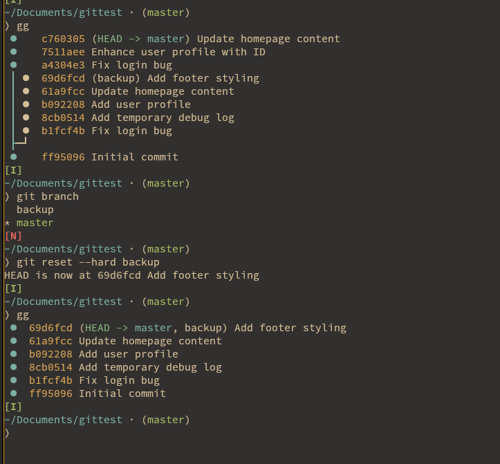

# Git Interactive Rebase Demo

This guide provides a step-by-step demonstration of using `git rebase -i` to modify a commit history, including `reword`, `squash`, `drop`, `edit`, and `fixup` options.

## Steps

### Step 1: Initialize a New Git Repository

1. Create and navigate to a new directory:

   ```bash
   mkdir git-rebase-demo
   cd git-rebase-demo
   ```
2. Initialize a Git repository:

   ```bash
   git init
   ```

### Step 2: Create the Initial Commit

1. Create a `README.md` file:

   ```bash
   echo "# Project Demo" > README.md
   ```
2. Stage and commit the file:

   ```bash
   git add README.md
   git commit -m "Initial commit"
   ```

### Step 3: Add the "Fix login bug" Commit

1. Create a `login.js` file:

   ```bash
   echo "function login() { console.log('Login'); }" > login.js
   ```
2. Stage and commit:

   ```bash
   git add login.js
   git commit -m "Fix login bug"
   ```

### Step 4: Add the "Add temporary debug log" Commit

1. Modify `login.js` to add a debug log:

   ```bash
   echo "console.log('Debug');" >> login.js
   ```
2. Stage and commit:

   ```bash
   git add login.js
   git commit -m "Add temporary debug log"
   ```

### Step 5: Add the "Add user profile" Commit

1. Create a `profile.js` file:

   ```bash
   echo "function getProfile() { return 'User'; }" > profile.js
   ```
2. Stage and commit:

   ```bash
   git add profile.js
   git commit -m "Add user profile"
   ```

### Step 6: Add the "Update homepage content" Commit

1. Create an `index.html` file:

   ```bash
   echo "<h1>Welcome</h1>" > index.html
   ```
2. Stage and commit:

   ```bash
   git add index.html
   git commit -m "Update homepage content"
   ```

### Step 7: Add the "Add footer styling" Commit

1. Create a `styles.css` file:

   ```bash
   echo "footer { color: blue; }" > styles.css
   ```
2. Stage and commit:

   ```bash
   git add styles.css
   git commit -m "Add footer styling"
   ```

### Step 8: Verify the Commit History

1. View the commit history:

   ```bash
   git log --oneline
   ```

   Expected output (hashes will differ):

   ```
   d4f5e6c (HEAD -> main) Add footer styling
   a3b2c1d Update homepage content
   9e8f7g6 Add user profile
   7890abc Add temporary debug log
   4567def Fix login bug
   1234567 Initial commit
   ```

### Step 9: Create a Backup Branch

1. Create a backup branch to preserve the original history:

   ```bash
   git branch backup
   ```

### Step 10: Start Interactive Rebase

1. Run the interactive rebase for the last 5 commits:

   ```bash
   git rebase -i HEAD~5
   ```
2. Your text editor opens with:

   ```
   pick 4567def Fix login bug
   pick 7890abc Add temporary debug log
   pick 9e8f7g6 Add user profile
   pick a3b2c1d Update homepage content
   pick d4f5e6c Add footer styling
   
   # Rebase 4567def..d4f5e6c onto 1234567
   # Commands:
   #  p, pick = use commit
   #  r, reword = use commit, but edit the commit message
   #  e, edit = use commit, but stop for amending
   #  s, squash = use commit, but meld into previous commit
   #  f, fixup = like "squash", but discard this commit's message
   #  d, drop = remove commit
   #  ...
   ```

### Step 11: Modify the Rebase Instructions

1. Edit the file to:
   - Change `pick` to `reword` for "Fix login bug" to edit its message.
   - Change `pick` to `drop` for "Add temporary debug log" to remove it.
   - Change `pick` to `edit` for "Add user profile" to modify its contents.
   - Change `pick` to `fixup` for "Add footer styling" to combine it with "Update homepage content" while discarding its message. Updated file:

   ```
   reword 4567def Fix login bug
   drop 7890abc Add temporary debug log
   edit 9e8f7g6 Add user profile
   pick a3b2c1d Update homepage content
   fixup d4f5e6c Add footer styling
   ```
2. Save and close
### Step 12: Reword the "Fix login bug" Commit

1. The editor opens with:

   ```
   Fix login bug
   ```
2. Change it to:

   ```
   Resolve login issue
   ```
3. Save and close.

### Step 13: Drop the "Add temporary debug log" Commit

1. Git automatically removes the "Add temporary debug log" commit due to the `drop` command and proceeds to the next step.

### Step 14: Edit the "Add user profile" Commit

1. Git pauses for the `edit` command, allowing you to modify the commit.
2. Update `profile.js` to add more functionality:

   ```bash
   echo "function getProfile() { return { name: 'User', id: 1 }; }" > profile.js
   ```
3. Amend the commit with a new message:

   ```bash
   git add profile.js
   git commit --amend -m "Enhance user profile with ID"
   ```
4. Continue the rebase:

   ```bash
   git rebase --continue
   ```

### Step 15: Fixup the "Add footer styling" Commit

1. Git combines "Add footer styling" into "Update homepage content" using `fixup`, discarding the "Add footer styling" message. The editor opens with only:

   ```
   Update homepage content
   ```
2. Keep or modify the message (optional):

   ```
   Update homepage content and footer styling
   ```
3. Save and close.

### Step 16: Verify the New Commit History

1. Check the updated history:

   ```bash
   git log --oneline
   ```

   Expected output (hashes will differ):

   ```
   abc1234 (HEAD -> main) Update homepage content and footer styling
   9e8f7g6 Enhance user profile with ID
   4567def Resolve login issue
   1234567 Initial commit
   ```

#Demo/devops/git/interactiveRebase






### Step 17: Handle Conflicts (if applicable)

If conflicts occur during the rebase:

1. Git pauses and shows conflicting files.
2. Open the files, resolve conflicts (look for `<<<<<<<`, `=======`, `>>>>>>>` markers), and save.
3. Stage resolved files:

   ```bash
   git add <file>
   ```
4. Continue the rebase:

   ```bash
   git rebase --continue
   ```

### Step 18: Push to Remote (if applicable)

If you’ve pushed the branch to a remote (e.g., GitHub):

1. Force push the rewritten history:

   ```bash
   git push --force
   ```

   **Caution**: Coordinate with your team, as this rewrites history.

### Step 19: Revert to Backup (if needed)

If the rebase fails or you want to undo:

1. Reset to the backup branch:

   ```bash
   git checkout main
   git reset --hard backup
   ```
