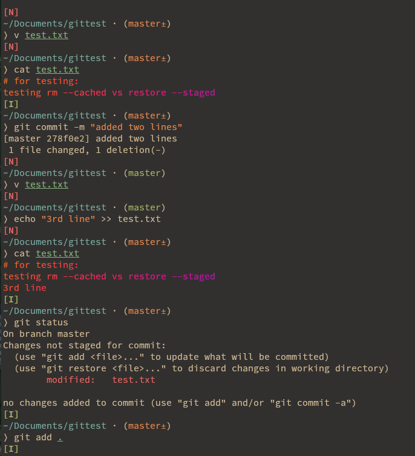
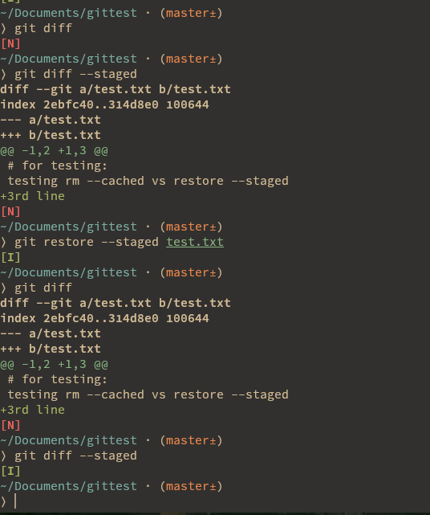

#### Key Concept: What does git restore --staged file really do?
- It resets the index (staging area) copy of the file to match the HEAD commit.
- It does not touch the working directory.
- It does not remove the file from disk.
- It replaces what's staged with whatever version exists in the latest commit (HEAD).
#### So what happens if... the file doesn't exist in the `HEAD` commit?
- That means it’s a brand new file you’ve never committed.
- Now Git is doing this: Let me get the version of this file from `HEAD` and put that into the staging area. But `HEAD` has **no version** of the file.
```sh
git restore --staged new_file.txt
``` 
- becomes: There’s no version to restore, so just remove it from staging.
- Which is exactly what `git rm --cached` would do in this case.
#### Real Example to Illustrate:
1. Create a new file:
```sh
echo "my secret key" > secret.txt
git add secret.txt
```
2. File is staged now, but not committed. Check status:
```sh
git status
# new file: secret.txt
```
3. Run:
```sh
git restore --staged secret.txt
```
==Git says: "There's no version in HEAD → remove it from index."==
Now run:
```sh
git status
```
You’ll see:
```txt
Untracked files:
  secret.txt
```
Which is the exact same result you’d get with:
```sh
git rm --cached secret.txt
```
#### in a situation where the file has a version in the current commit (HEAD).
What Happens (When the File Exists in HEAD):
- `git restore --staged <file>` resets the staged version of the file to match what’s in the HEAD commit (the latest commit on your branch).
- It does NOT touch: 
	- The file on disk (your working directory)
	- The file’s tracked status (Git still knows about it)
- Git, undo what I just `git add`, go back to what the last commit looked like in the index (staging area).
#### Real Example: File has a history (already committed)
1. Current hello.txt in HEAD:
```txt
Hello Git
```
2. You modify it:
```txt
Hello Git
Welcome to the magic!
```
3. You stage it:
```sh
git add hello.txt
```
4. Then run:
```sh
git restore --staged hello.txt
```
Now:
- The staging area version reverts to `Hello Git` (what's in `HEAD`)
- Your working copy still shows both lines
Let’s Confirm That Step-by-Step:
```sh
git diff             # shows: Welcome to the magic! (unstaged)
git diff --staged    # shows: nothing (restored back to HEAD version)
```
That means:
- You’ve unstaged the changes
- You’re back to a clean index, but still working on the file
#Demo/devops/git/RestoreRm

